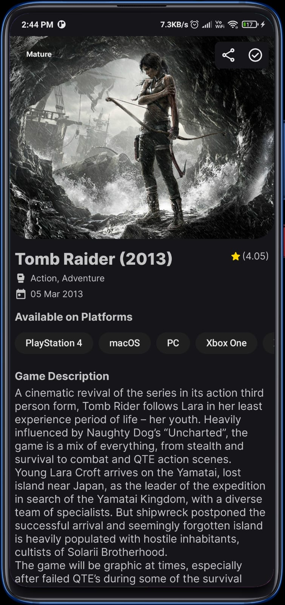
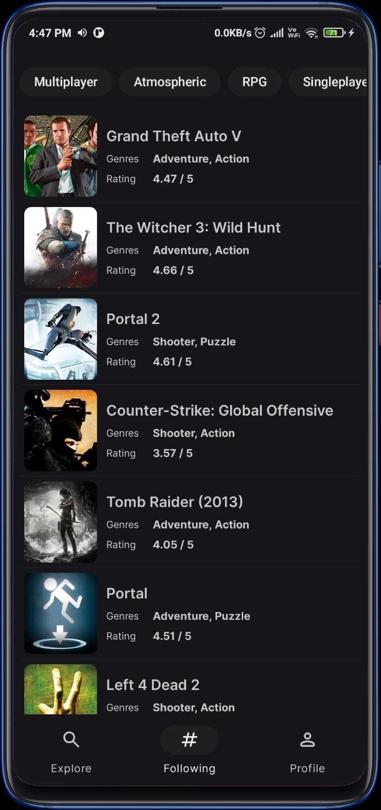

# Geemu: Your Ultimate Gaming Companion 🎮
Geemu is a sleek and intuitive Android app that serves as a client for the RAWG API. Discover a world of games, stay updated on upcoming releases, explore top charts, and follow your favorite gaming tags. With Geemu, you can curate your personal game collection, track visual insights, and stay immersed in the gaming universe. Your gateway to seamless gaming experiences. Level up with Geemu! 🔥✨

## Table of Contents

- [Screenshots](#screenshots)
- [Installation](#installation)
- [License](#license)
- [Contribute](#how-to-contribute)

## Screenshots

|  |  |  |  |  |  | 
| -------------------------- | -------------------------- | -------------------------- | -------------------------- | -------------------------- | -------------------------- |

## Installation

### Manual Installation
1. Clone this repository to your local machine using the following command:
```
git clone https://github.com/SidharthMudgil/geemu.git
```
2. Open the project in Android Studio.

3. Build the project and install it on your Android device.

### APK Installation
1. Download the [latest APK](https://github.com/SidharthMudgil/geemu/releases/latest/download/geemu.apk) file from the "Releases" section of this GitHub repository.

2. Enable "Unknown Sources" in your Android device settings to allow the installation of apps from external sources.

3. Locate the downloaded APK file and install it on your Android device.


## License
This project is licensed under the [GPL-3.0](LICENSE).

## How to Contribute
Interested in contributing to this project? Please read our [Contribution Guidelines](CONTRIBUTING.md) to get started.
